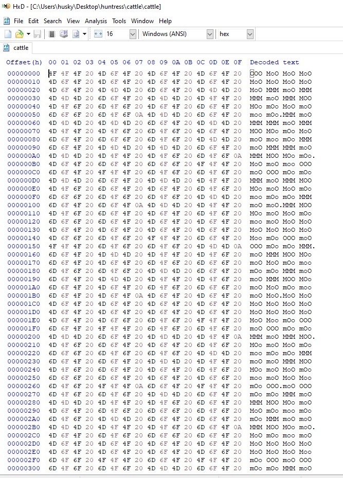
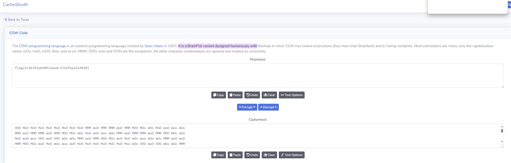

# Cattle

## Description

```
I know it's an esoteric challenge for a Capture the Flag, but could you herd these cows for me?
```

## Mooo0o0oo

Not much was said about what type of file this is so taking a malware analysis and forensic approach to this let's first open the file in HxD (or any hex editor)



That's a lot of Moooo 🐄

Well there's lot's of variations of Moo mOo mOO, etc so maybey this is an alphabet. Let's do a quick search for a "Moo Cipher".

Ok, that's actually a thing...

[Moo Cipher](https://www.cachesleuth.com/cow.html#:~:text=It%20is%20a%20Brainf*ck%20variant%20designed%20humorously%20with)

Decode the whole text in here and you'll get the flag out as the result.


