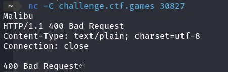
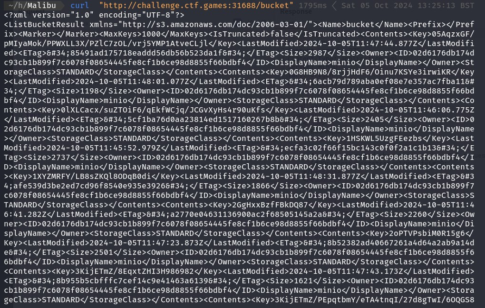
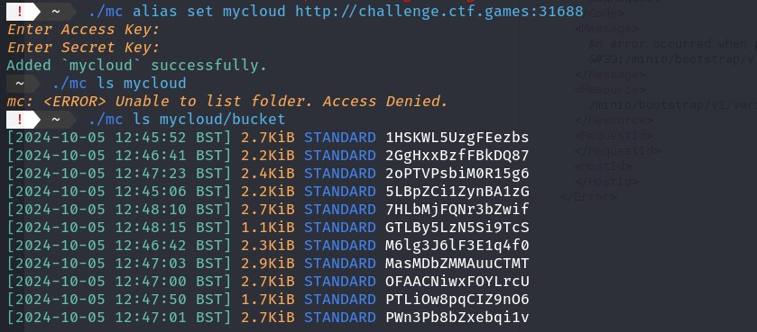
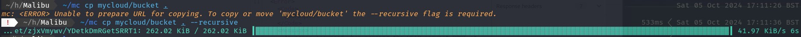
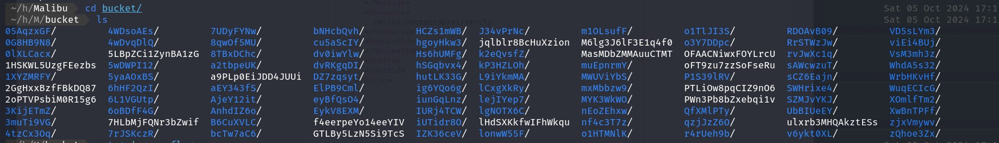
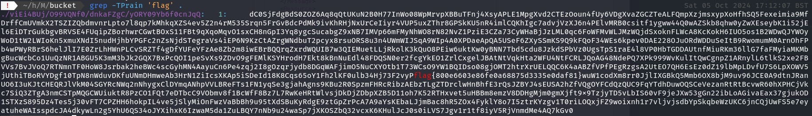

# Malibu

## Description

What do you bring to the beach?

NOTE: There are two things to note for this challenge.
This service takes a bit more time to start. If you see a Connection refused, please wait a bit more.

This service will not immediately respond or prompt you... it is waiting for your input. If you just hit Enter, you will see what it is.

Extra tip, once you know what the service is, try connecting in a better way. Then use some of the context clues and critical thinking based off its response and the challenge description. You don't need any bruteforcing once you understand the infrastructure and enumerate. ;)


## Buckets!

The first thing the challenge asks us to do is connect to the server with netcat.



Entering anything basic just gives a 400 Bad Request error so we can infer that it's a web server of some description.

Next [hernerwerzog](https://github.com/hernerwerzog) curl'd the http endpoint for the server on ```http://challenge.ctf.games:<port>``` and we could see that the response headers say this is a [MinIO](https://min.io/) server.

*MinIO is an object storage solution that provides an Amazon Web Services S3-compatible API and supports all core S3 features. MinIO is built to deploy anywhere - public or private cloud, baremetal infrastructure, orchestrated environments, and edge infrastructure.*

Well, S3 buckets sounds interesting. We tested various bucket names and eventually found one named 'bucket'. Requesting the bucket returns a large set of XML data.



In the data it seems to returnd a number of folders with ransomised names. That we got any data back is interesting.

To download anything we can use the minio [mc tool](https://github.com/minio/mc).

```sh
wget https://dl.min.io/client/mc/release/linux-amd64/mc
chmod +x mc
./mc --help
```

The first command to run is to create an *alias* to the server to run further commands against it.

```sh
./mc alias set mycloud http://challenge.ctf.games:31688
```

This then asks for an access key and a secret which... well we don't have that. After trying a number of different ways to try and get the key including CVE's and trawling through the XML data, it occured that we already got the data. What's the most common issue with S3 buckets over the last 10 years? Publicly accessible with no authentication.

So I tried leaving the access key and secret blank...



To list the folders in the bucket you can use the *ls* command.

```sh
./mc ls mycloud/bucket
```

Then to copy the data recusively to the local disk we can use the *cp* command.

```sh
./mc cp --recursive mycloud/bucket .
```




Finally grep recursively through the folders for anything with flag in.

```sh
grep -TPrain 'flag' .
```



---

**EDIT**: I **just** realised that you take a *bucket* to the beach 🤦‍♂️