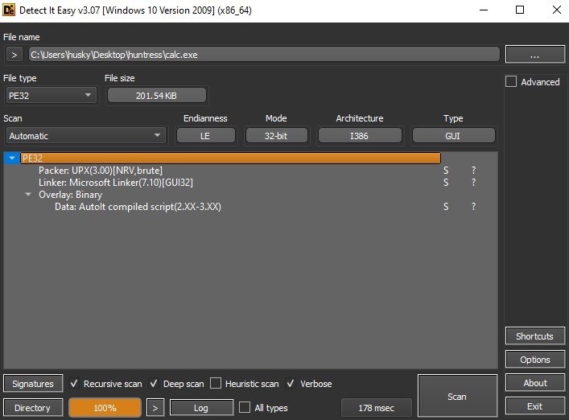
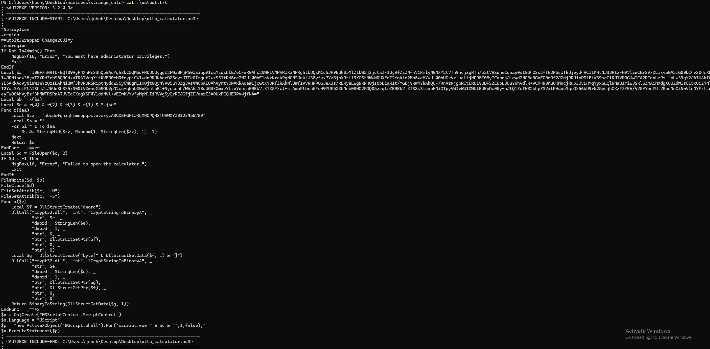
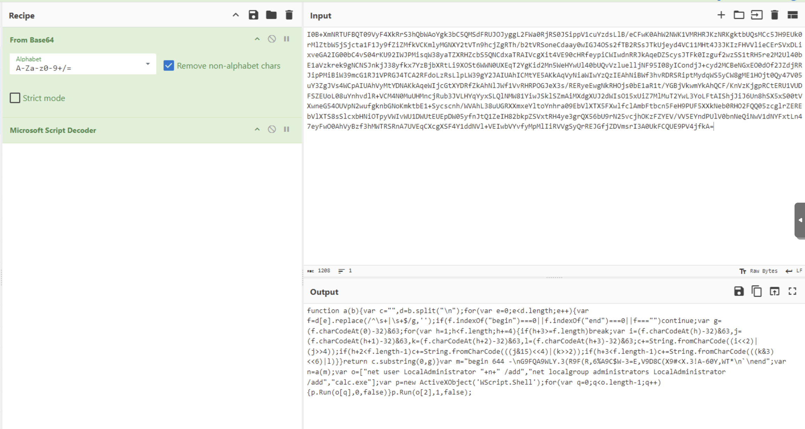
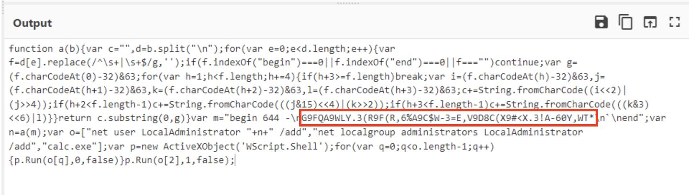
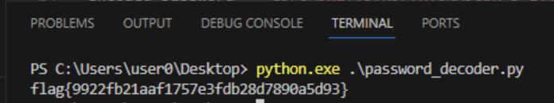

# Strange_Calc

The medium challenge for the day starts with a zip file containing a calc.exe file. The first thing to do is to see what this file it. I like to open it in detect it easy first to get a view of how it's compiled.



You can see in the output that this is an AutoIT compiled script. We can use a tool called [autoit-extractor](https://github.com/digitalsleuth/autoit-extractor/releases/tag/v1.0.0) to decompile the executable in to it's original au3 script.

```
.\AutoIt-Extractor-net40-x86.exe .\calc.exe
```



One of the functions of the script is to create a malicous JScript file using the contents of $a. The contents of $a is initially base64 encoded and is then further encoded. We can decode the contents of the script with CyberChef using the following recipe.

```
From_Base64('A-Za-z0-9+/=',true,false)
Microsoft_Script_Decoder()
```



Within the contents of the decoded script, we can see a string which is further encoded.



We can use some Python to decode the string, revealing the flag.

[password_decoder.py](https://github.com/calorushex/huntress2024/blob/main/Strange_Calc/password_decoder.py)

``` python
def decode(encoded):
    c = ""
    lines = encoded.split("\n")
    for line in lines:
        line = line.strip()
        if line.startswith("begin") or line.startswith("end") or not line:
            continue
        g = (ord(line[0]) - 32) & 63
        for h in range(1, len(line), 4):
            if h + 3 >= len(line):
                break
            i = (ord(line[h]) - 32) & 63
            j = (ord(line[h + 1]) - 32) & 63
            k = (ord(line[h + 2]) - 32) & 63
            l = (ord(line[h + 3]) - 32) & 63
            c += chr((i << 2) | (j >> 4))
            if h + 2 < len(line) - 1:
                c += chr(((j & 15) << 4) | (k >> 2))
            if h + 3 < len(line) - 1:
                c += chr(((k & 3) << 6) | l)
    return c[:g]

# decode password
encoded_password = "G9FQA9WLY.3(R9F(R,6%A9C$W-3=E,V9D8C(X9#<X.3!A-60Y,WT*"
decoded_password = decode(encoded_password)
print(decoded_password)
```


