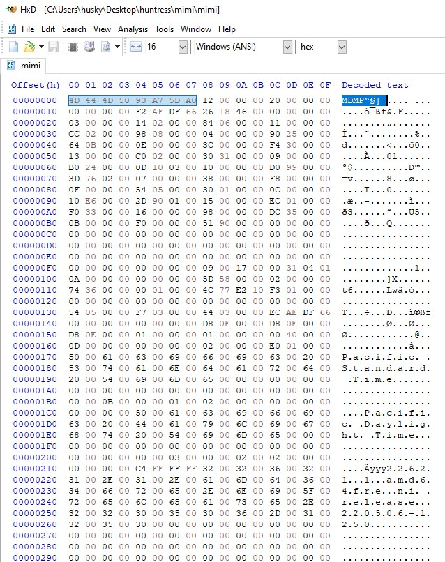
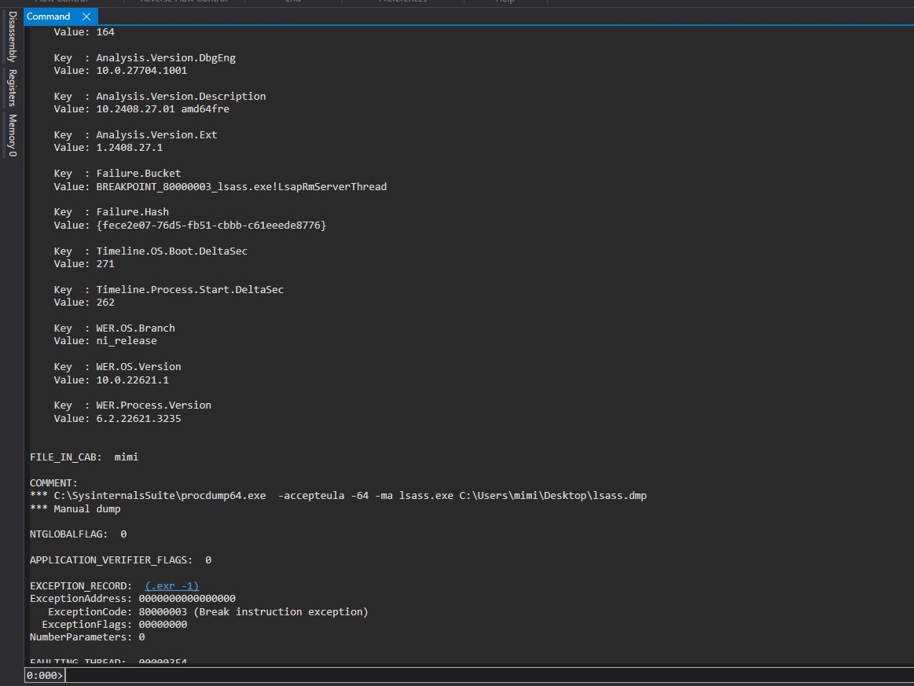
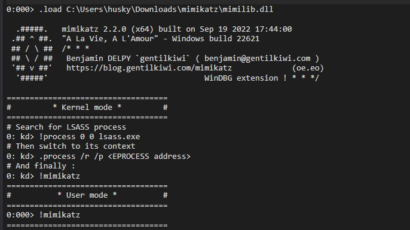
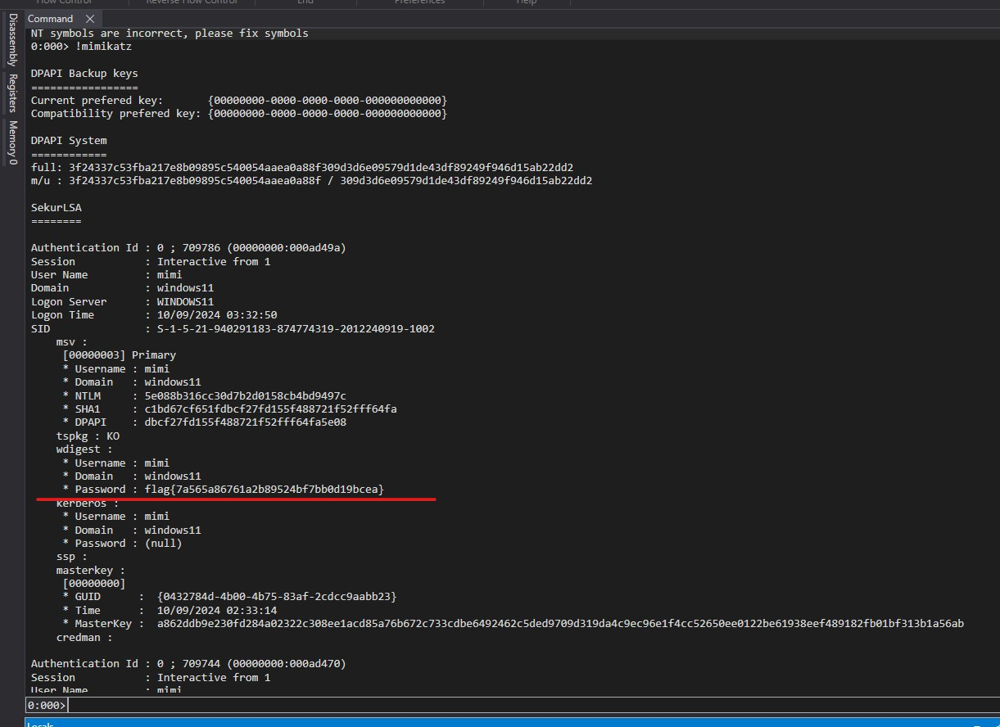

# Mimi

## Description

Uh oh! Mimi forgot her password for her Windows laptop!

Luckily, she dumped one of the crucial processes running on her computer (don't ask me why, okay)... can you help her recover her password?

NOTE: This file on its own is not malware per say, but it is likely to raise antivirus alerts. Would recommend examining this inside of a virtual environment.

NOTE: Archive password is mimi

## Katz

We are provided with a file named mimi. On initial analysis using a hex editor we can see that the file header is MDMP which makes it likely a dump of a Windows process.



Taking that as an assumption, the name of the challenge and the name, and the description I think we can safely guess that this is a dump of the lsass process from a Windows machine.

Recently I've learning to do this in WinDbg and enjoying it more. In WinDbg open the file and wait for it to load. When done run the following command

```
!analyze -v
```



This confirms what we suspected before that it is a lsass dump from using SysInternals procdump.

Next step is to import the Mimikatz dll.

```
.load C:\Users\husky\Downloads\mimikatz\mimilib.dll
```



Once that's loaded successfully you can run ```!mimikatz``` to run mimikatz against the loaded dump. From the output you can see that there was a user *mimi* with the password as the flag.

